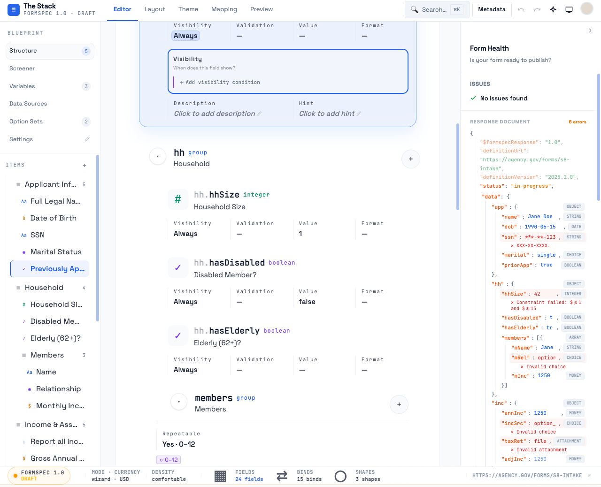
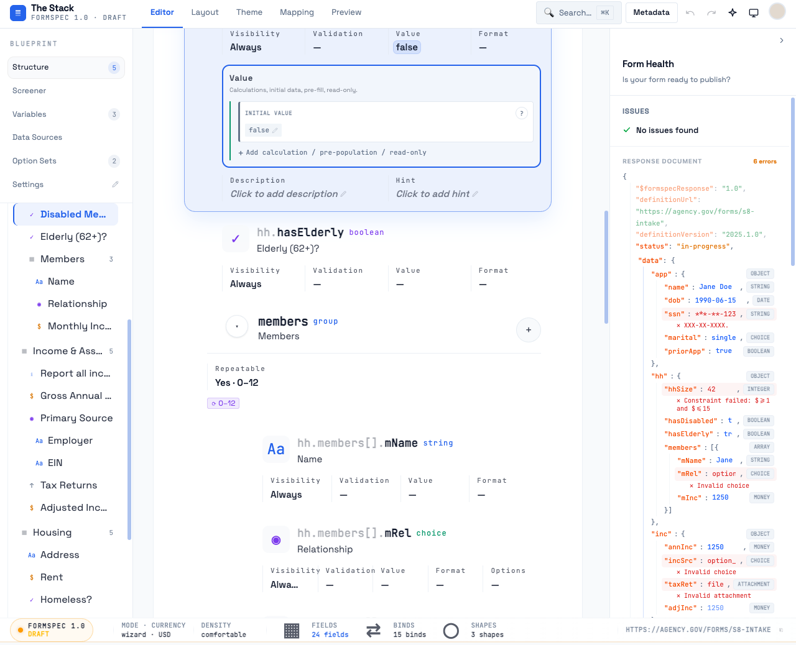
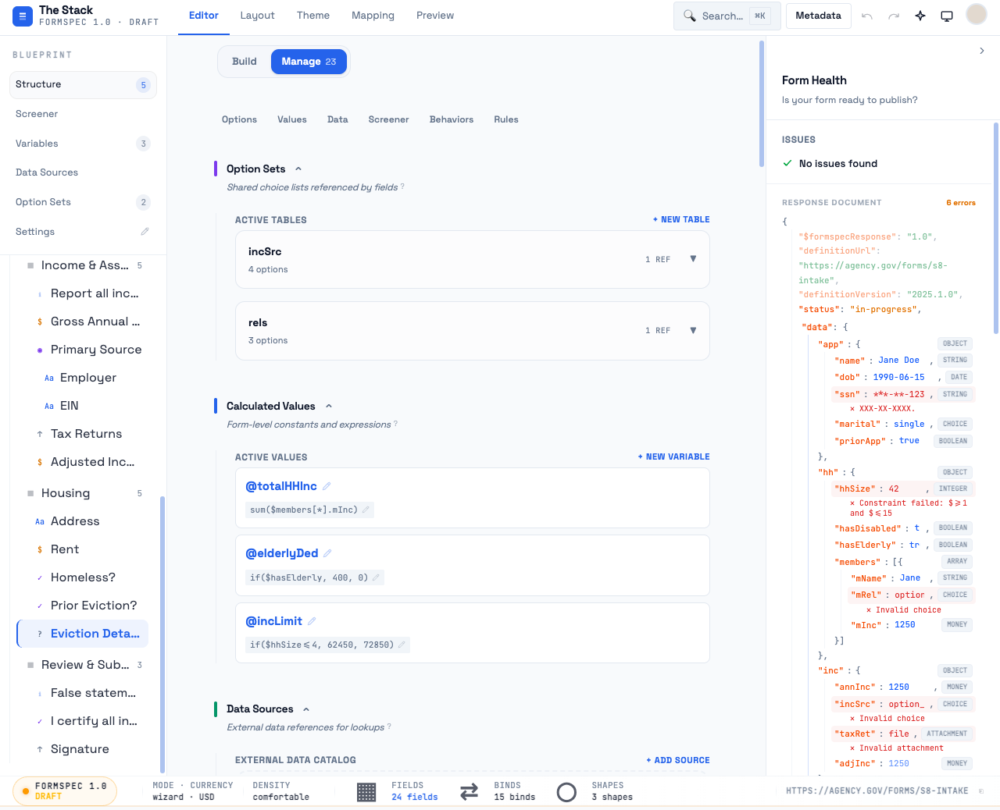
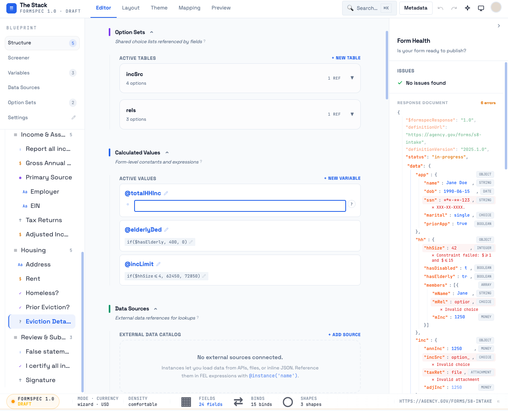
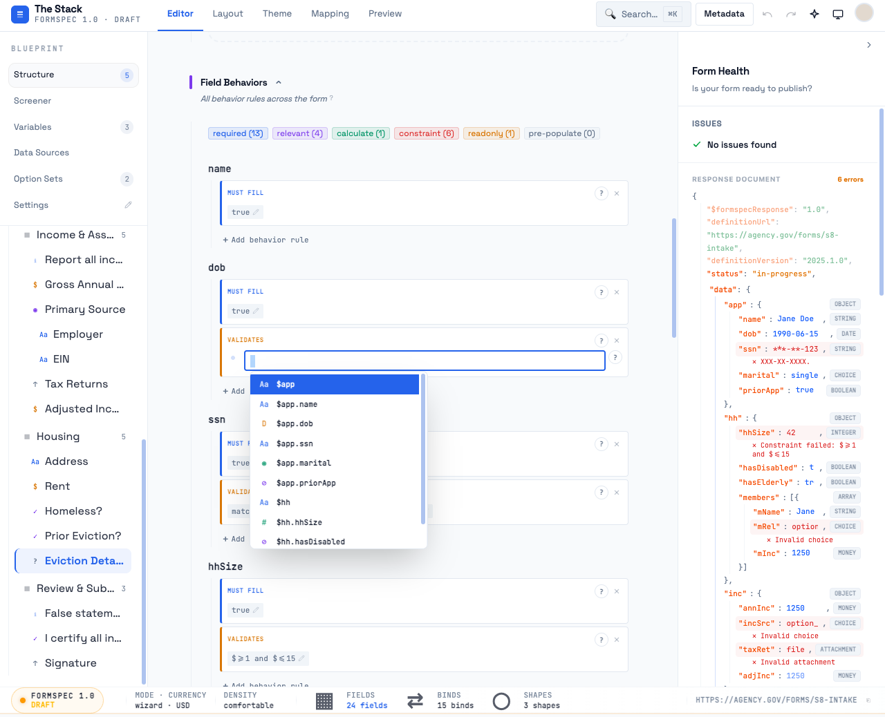
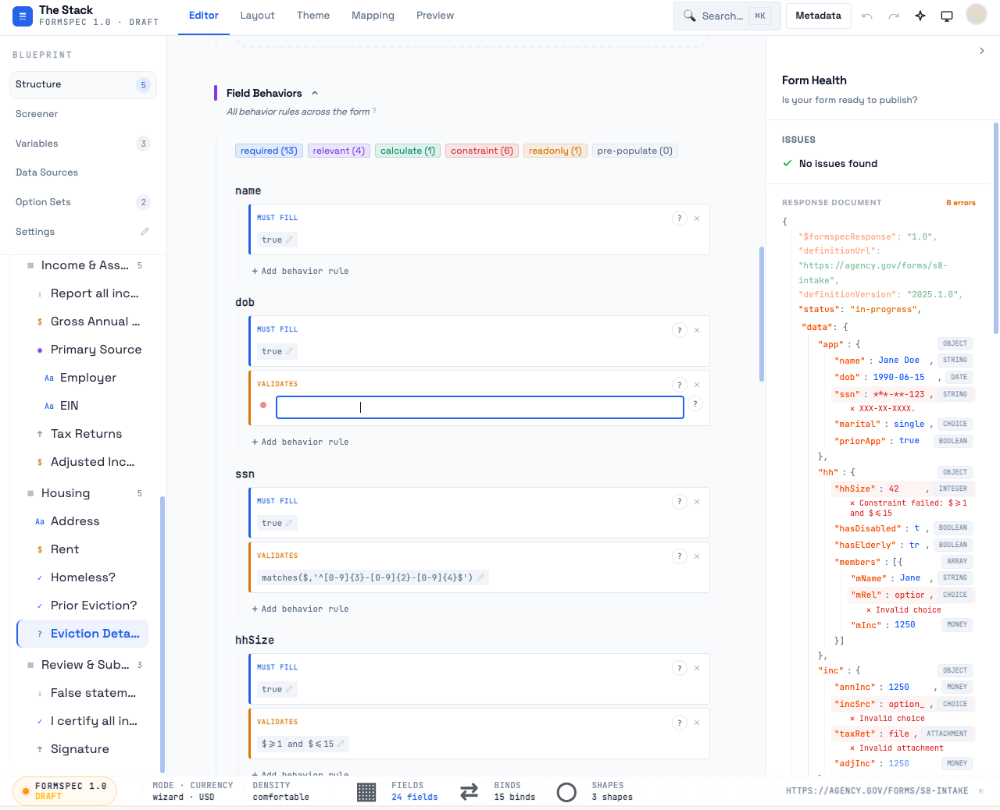
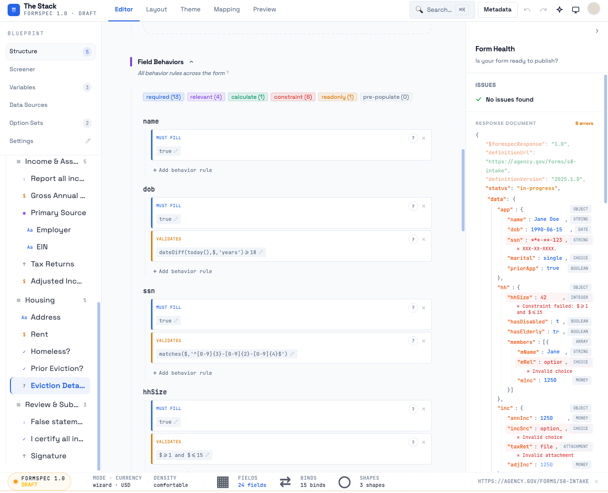
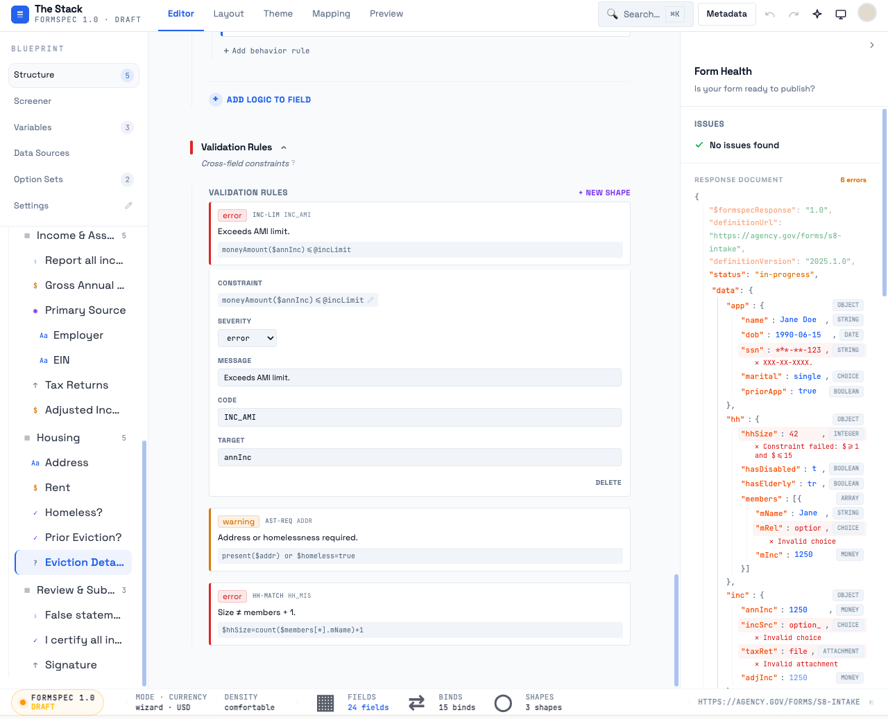

# FEL Input UX Audit — 2026-04-01

**Verdict: CSS fix + component restructure**

The FEL input experience suffers from six distinct problems, ranging from a fundamental invisible-text bug in the editor to a missing visual identity for the display state. None require redesigning the architecture — the underlying implementation is capable. But the symptoms are widespread enough that a user writing more than one expression will hit every one of them.

---

## 1. Inventory

| Surface | Context | Component | File |
|---|---|---|---|
| **A** BindCard in ItemRowCategoryPanel | Visibility / Validation / Value panels (Build view) | `InlineExpression` + `FELEditor` | `ItemRowCategoryPanel.tsx` |
| **B** BindCard in ManageView Behaviors tab | Per-field bind list (Manage / Behaviors) | `InlineExpression` + `FELEditor` | `BindsSection.tsx` + `BindCard.tsx` |
| **C** Variable expression in ManageView | `@totalHHInc`, `@elderlyDed`, `@incLimit` (Manage / Values) | `InlineExpression` + `FELEditor` | `VariablesSection.tsx` |
| **D** Shape constraint in ManageView | Cross-field validation rules (Manage / Rules) | `InlineExpression` + `FELEditor` | `ShapesSection.tsx` |
| **E** Screener route condition | Route card conditions (Manage / Screener) | `InlineExpression` + `FELEditor` | `RouteCard.tsx` |
| **F** Shape expression in ShapeCard display row | Non-editable expression preview in ShapeCard | Plain monospace `div` | `ShapeCard.tsx` (separate, not InlineExpression) |

All editable FEL surfaces use the same two-component pattern:
- `InlineExpression` — display mode (badge chip) + click-to-edit transition
- `FELEditor` — editing mode (textarea + highlight overlay + autocomplete dropdown)

---

## 2. Screenshots

### State 1 — Build view, category panel with bind (empty state)


### State 2 — Build view, Value category with INITIAL VALUE bind


### State 3 — Manage view, Calculated Values (display mode)


### State 4 — FELEditor active, focused (editing mode)


### State 5 — FELEditor with autocomplete open


### State 6 — FELEditor error state (invalid expression)


### State 7 — Behaviors tab (Manage), multiple binds in display mode


### State 8 — InlineExpression in edit mode (inside BindCard, Behaviors tab)


### State 9 — Shape constraint editor (Rules tab)


---

## 3. Problems

### P1 — CRITICAL: The editor appears completely blank when focused

**Severity: Critical**

When you click an expression to edit it, the FELEditor activates and the textarea appears empty. The user sees a blank white box with a blinking cursor. The actual expression is present (it's in the textarea's `.value`) but invisible because the textarea has `color: rgba(0,0,0,0)` (transparent text) by design — this is the technique used to make the syntax highlighting overlay show through.

The bug: the highlight overlay must render on top of the transparent textarea text. In practice, when the editor first activates, the overlay text is properly rendered (DOM inspection confirms it). The problem is **visual registration is broken** — the overlay `div` is `absolute inset-0` but the computed CSS font size on the overlay (`11px`, JetBrains Mono, `line-height: 17.875px`, `padding: 6px 8px`) must match the textarea exactly. From DOM inspection:

- Textarea: `font-size: 11px`, `font-family: "JetBrains Mono"`, `padding: 6px 8px`, `line-height: leading-relaxed` (Tailwind = `1.625` = `~17.875px`)
- Overlay: `font-size: 11px`, `font-family: "JetBrains Mono"`, `padding: 6px 8px`, `line-height: 17.875px`

These match. But in the **Behaviors tab context** (screenshot 10), the FELEditor appears inside a BindCard's `children` slot inside a `div.border.border-l-[3px]` with constrained width. The textarea width is `523px` — wider than its container at certain scroll positions — and the absolute overlay may not correctly overlay when the parent has `overflow: hidden` or specific stacking behavior.

More critically, the **visual experience of "blank on focus"** is real and unavoidable with the current approach: the first frame when the editor mounts shows the transparent textarea before React has re-rendered the overlay with tokens. There is a perceived flash of blank content on every edit activation.

**Root cause:** Transparent-text overlay technique has an inherent first-frame blank flash. The overlay also suffers from a path highlighting defect (see P3).

**Fix:** Replace `text-transparent` on the textarea with `caret-color: var(--studio-color-ink); color: transparent`. This is already done. The real fix for the flash is to pre-render the highlight tokens into the overlay before the textarea is focused by using a `defaultValue` seed. Additionally, ensure the `autoFocus` in `FELEditor.tsx` line 61 triggers `autoResize` before the first render paints by moving the height calculation into the layout phase (`useLayoutEffect`, not `useEffect`).

---

### P2 — HIGH: The error indicator is too subtle and carries no message

**Severity: High**

When an expression has a syntax error, the gutter shows a `w-2 h-2 rounded-full bg-error animate-pulse` red dot. This is the only visible indication.

Problems:
1. The red dot is 8x8px. In the BindCard context, the gutter is 16px wide (`w-4 shrink-0`). The dot is visually adjacent to the textarea border and easily confused with a decorative element.
2. The error message is in the dot's `title` attribute only — no tooltip, no visible text, no border color change on the textarea.
3. When the error state is active, the textarea border is still `border-accent/40` (blue focus ring) — there is no visual differentiation between "focused and valid" and "focused and broken". The user cannot tell at a glance that the expression is malformed; only a tiny dot provides the signal.
4. The non-error state is an even smaller `w-1.5 h-1.5` (6px) `bg-accent/20` dot — this is the visual baseline. The delta between "ok" and "error" is: dot goes from 6px/20%-opacity-accent to 8px/full-error with pulse animation. Too subtle.

**Root cause:** The error state is a CSS tweak on a tiny indicator rather than a full state change. The textarea border, background, and label area are unaffected.

**Fix:** On error:
- Change textarea border to `border-error` (red)
- Add a `bg-error/5` background tint to the textarea
- Show the `syntaxError` message below the textarea in a `text-[10px] text-error` row (not just in `title`)
- The dot can remain as an additional indicator, but it cannot be the primary one

---

### P3 — HIGH: Path highlighting is broken — only the `$` is green

**Severity: High**

The syntax highlighting overlay uses `buildFELHighlightTokens()` to colorize tokens. For field paths like `$members[*].mInc`, the tokenizer produces:

```
{ kind: 'function', text: 'sum' }   → text-logic, underline
{ kind: 'plain', text: '(' }         → text-ink/80
{ kind: 'path', text: '$' }          → text-green ← only this is green
{ kind: 'plain', text: 'members' }   → text-ink/80 ← should also be green
{ kind: 'plain', text: '[' }         → text-ink/80
{ kind: 'operator', text: '*' }      → text-muted/60
{ kind: 'plain', text: ']' }         → text-ink/80
{ kind: 'operator', text: '.' }      → text-muted/60
{ kind: 'plain', text: 'mInc' }     → text-ink/80 ← should also be green
```

Only the `$` sigil gets the green path color. The field name and bracket notation are tokenized as `plain` text. This defeats the purpose of path highlighting — the user cannot visually identify which tokens are field references vs operators vs plain text.

**Root cause:** `buildFELHighlightTokens()` in studio-core tokenizes `$` as a path token but then produces separate `plain` tokens for the path segments. The path token does not extend to cover the full `$field.path` reference.

**Fix:** The tokenizer needs to emit the entire `$field.path.segment` or `$group[*].field` span as a single `path` token. This is a studio-core change in `packages/formspec-studio-core/src/` (wherever `buildFELHighlightTokens` is defined). Until fixed, the entire reference looks like plain text with a lone green `$`.

---

### P4 — MEDIUM: InlineExpression display state is aesthetically invisible

**Severity: Medium**

The display state of `InlineExpression` renders as a small chip:
```
text-[11px] text-muted bg-subtle px-1.5 py-0.5 rounded-[2px] height: 21px
```

The chip is `text-muted` on `bg-subtle` — this is the same styling used for metadata labels and secondary information throughout the studio. The expression chips carry **zero visual differentiation** from surrounding label text. They look like dimmed text badges, not interactive code.

Specific failures:
1. **No syntax highlighting in display mode** — the chip shows raw expression text with no color. `moneyAmount($annInc) ≤ @incLimit` is rendered as flat grey text. The user gets no visual help reading it.
2. **No "code" affordance** — there is no visual distinction between "this is an expression you wrote in a special language" vs "this is a plain string". The JetBrains Mono font is used, but at 11px and `text-muted` it reads as technical metadata, not user-authored logic.
3. **The hover target is the chip only** — a chip 21px tall with 6px total vertical padding. Difficult to target precisely.
4. **Edit affordance is hidden by default** — the pencil icon is `opacity-30`, becoming `opacity-60` on hover. It's barely visible at rest. The chip itself looks like a non-interactive badge.
5. **No distinction between `true` (trivial/always) and `$evHist=true` (meaningful expression)** — both render identically. There is no way to scan a list of binds and immediately tell which ones have trivial defaults vs real logic.

**Root cause:** The InlineExpression display chip was designed as a space-efficient badge, not as a first-class code view. It communicates "there is something here" but not "here is logic you authored".

**Fix:** Two-track fix:
- **Track A (quick):** Add a faint `border border-border/60` to the chip to give it an input-field-adjacent look. Change `text-muted` to `text-ink/70` so it reads at normal text weight. Add a `bg-subtle/50` when the value is `true` or another trivial expression to visually deprioritize trivial binds.
- **Track B (proper):** Render inline syntax highlighting in display mode using the same `buildFELHighlightTokens` system. This makes `$evHist=true` show the path in green and the operator muted — immediately scannable.

---

### P5 — MEDIUM: FELEditor height starts at 28px — too short for real expressions

**Severity: Medium**

The `FELEditor` textarea starts at `min-h-[28px]` (one line). `autoResize()` grows it dynamically, but the **initial activation state** is always a single-line box. When the user clicks an expression like `dateDiff(today(),$,'years') >= 18` (which is 32 characters), it opens into a single-line box where the full expression is visible but cramped — the user cannot tell if there's more text off-screen.

For the BindCard context, the card width is roughly 500–530px, so a 32-character expression at 11px JetBrains Mono (~6.6px/char) is about 211px wide — it does fit in one line. But for `money(moneyAmount($annInc)-@elderlyDed,'USD')` (47 chars = ~310px), the expression wraps to two lines at narrow widths, and the initial `min-h-[28px]` doesn't auto-expand until after the first onChange event.

The `autoResize` function runs on `onChange` — not on initial mount. This means that when a BindCard opens in editing mode with an already-long expression, the textarea shows only the first line of content until the user types a character.

**Root cause:** `autoResize` is called in `onChange` but not in the `autoFocus` `useEffect`. The `autoFocus` effect focuses the textarea but does not trigger resize.

**Fix:** In `FELEditor.tsx` lines 59-63:
```ts
useEffect(() => {
  if (autoFocus && textareaRef.current) {
    textareaRef.current.focus();
    autoResize(textareaRef.current);  // already here — but...
  }
}, [autoFocus]);
```
The `autoResize` call is already there. But the timing may be wrong: it runs after mount, when the textarea hasn't rendered at its final size yet. Switch to `useLayoutEffect` to ensure it runs synchronously after DOM layout:
```ts
useLayoutEffect(() => {
  if (autoFocus && textareaRef.current) {
    autoResize(textareaRef.current);
    textareaRef.current.focus();
  }
}, [autoFocus]);
```

---

### P6 — MEDIUM: Autocomplete shows paths without labels — just `$path`

**Severity: Medium**

The autocomplete dropdown lists all field paths with type icons and the `$path` string. For a form with nested groups, paths like `$hh.members[].mInc` are listed — but there is no human-readable label shown alongside the path in the list item. The `FELEditorFieldOption` interface has `label: string` and the `fieldOptions` useMemo maps `fi.item.label || fi.path` to `label`. But in the rendered list item:

```tsx
<span className="font-bold truncate">
  {opt.kind === 'path' ? `$${opt.path}` : opt.kind === 'function' ? opt.name : opt.name}
</span>
```

The `opt.label` is computed but never displayed. Only `$path` is shown. For a form with path `hh.members[].mInc`, the path alone gives no hint that this is "Monthly Income". A user writing their first expression does not know which path corresponds to which field without memorizing the key names.

**Root cause:** The autocomplete list item renders `$${opt.path}` unconditionally, ignoring `opt.label`.

**Fix:** Show both: `$path` as the primary monospace identifier, and `opt.label` as a secondary label below or after it:
```tsx
<div className="flex-1 min-w-0 flex flex-col gap-0.5">
  <span className="font-bold truncate">${opt.path}</span>
  {opt.label !== opt.path && (
    <span className="text-[10px] text-muted/80 truncate">{opt.label}</span>
  )}
</div>
```

---

### P7 — MEDIUM: BindCard expression display uses a different component/style than InlineExpression

**Severity: Medium**

When `BindCard` is used **without** children (display-only mode — not in the editing context), it renders the expression using:
```tsx
<div className={`font-mono text-[10px] text-muted px-1.5 py-0.5 rounded-[2px] truncate ${error ? 'bg-error/10' : 'bg-subtle'}`}>
  {expression}
</div>
```

This is a hardcoded `div` that is not `InlineExpression`. It's non-interactive (no click-to-edit), non-highlighted, uses `text-[10px]` (smaller than InlineExpression's `text-[11px]`), and has `truncate` which silently hides long expressions.

This creates two different visual languages for the "expression display" within BindCards:
1. When `children` is passed (active editing context): uses `InlineExpression` which is clickable, 21px tall, `text-[11px]`
2. When no `children` (Blueprint sidebar read-only view): uses the hardcoded `div`, 10px, truncated, non-interactive

The user sees the same BindCard component behave completely differently depending on which parent called it.

**Root cause:** BindCard is a display container that accepts children for the interactive expression, but also has a fallback static expression display. These two code paths have diverged in visual treatment.

**Fix:** The fallback static expression `div` in `BindCard.tsx` lines 85-93 should use the same styling as `InlineExpression`'s display state, or ideally just always pass `InlineExpression` as children from every callsite.

---

### P8 — LOW: The FEL Reference popup (`?`) button appears in two different positions

**Severity: Low**

The `FELReferencePopup` (the `?` button that opens a function catalog) appears:
- In `InlineExpression` editing mode: rendered as a sibling of `FELEditor` in a `flex items-start gap-1` row (`InlineExpression.tsx` line 65-66)
- In `BindCard` header: always visible in the card header row alongside the remove button (`BindCard.tsx` line 59)

In the editing context, the `?` appears both in the BindCard header AND as a sibling of the FELEditor (because `InlineExpression` renders its own `FELReferencePopup`). This means when editing a bind expression, there are two `?` buttons visible simultaneously: one in the BindCard header, one next to the textarea.

Additionally, the `FELEditor` component itself does NOT include a `FELReferencePopup` — it is the `InlineExpression` wrapper that adds one. But in the Variable editing context (`VariablesSection.tsx`), the FELEditor is rendered directly inside InlineExpression which does include the popup. This is consistent. But in `BindCard` the popup is always in the header regardless of whether editing is active — it floats permanently in the card header, disconnected from the editing surface.

**Fix:** Remove the `FELReferencePopup` from the `BindCard` header (it should only appear when the FEL expression is being actively edited). The correct placement is adjacent to the active `FELEditor` — which is where `InlineExpression` puts it. The BindCard header should show it conditionally: only when the expression child is in edit mode.

---

### P9 — LOW: No keyboard shortcut or commit UX affordance for the FELEditor

**Severity: Low**

The FELEditor saves on `onBlur` (with 150ms delay to allow autocomplete clicks). The only keyboard save shortcut is `Cmd+Enter` / `Ctrl+Enter`. There is no visible hint about save behavior, no "Save" button, no indication that the expression auto-saves on blur.

The `Escape` key cancels — but `InlineExpression` passes `onCancel` which sets `editing = false`. The user has no visual indication that Escape will revert their changes.

For a form author who just wrote a complex expression and is deciding whether to commit it, the save gesture is invisible.

**Fix:** Add a minimal footer below the textarea when content has changed from the original value: a `text-[10px] text-muted` hint `Return+Cmd to save · Esc to cancel`. This is already the behavior — it just needs to be surfaced. Alternatively, change `onBlur` to not auto-save and require an explicit save gesture, but that's a bigger UX change.

---

## 4. Priority

| # | Problem | Impact | Effort | Priority |
|---|---|---|---|---|
| P3 | Path highlighting broken (`$` only) | High — makes syntax highlighting actively misleading | Medium (studio-core tokenizer) | 1 |
| P1 | Editor appears blank on focus | High — core interaction is disorienting | Low (useLayoutEffect fix) | 2 |
| P2 | Error state too subtle | High — invalid expressions not visible | Low (CSS + add error message row) | 3 |
| P4 | Display state is invisible / no code identity | Medium — reduces scannability of the Behaviors view | Medium (add highlighting to display) | 4 |
| P6 | Autocomplete hides field labels | Medium — hinders discoverability | Low (render `opt.label`) | 5 |
| P5 | Editor starts too short | Medium — long expressions arrive pre-wrapped | Low (useLayoutEffect timing) | 6 |
| P7 | Two expression display styles in BindCard | Low — inconsistency but contained | Low (align styles) | 7 |
| P8 | Double `?` reference button | Low — cosmetic duplication | Low (conditional render) | 8 |
| P9 | No save UX affordance | Low — experienced users will adapt | Low (hint text) | 9 |

---

## 5. Root Cause Summary

These nine problems share two structural causes:

**Cause 1: The transparent-text overlay technique is fragile.** Invisible textarea + positioned highlight div works, but: (a) first-frame flash is inherent to the approach, (b) any overflow/stacking context mismatch breaks alignment, (c) the tokenizer must perfectly cover every visible character or blank patches appear. The tokenizer does not (P3). The solution is to fix the tokenizer, not abandon the technique.

**Cause 2: `InlineExpression` is the only display surface, and it prioritizes compactness over legibility.** The chip badge was the right call for space-constrained contexts, but now that the Behaviors and Rules tabs show lists of 15-25 expressions at once, the compact-badge approach makes the entire list visually flat and unscannable. Adding syntax highlighting to display mode (P4) and fixing path tokens (P3) would transform the scanability of both the Manage view and the Build category panels.

The biggest single unlock: **fix `buildFELHighlightTokens` to emit full path tokens** (P3). This fixes the highlighting in both edit mode and, once P4 is implemented, in display mode too.
