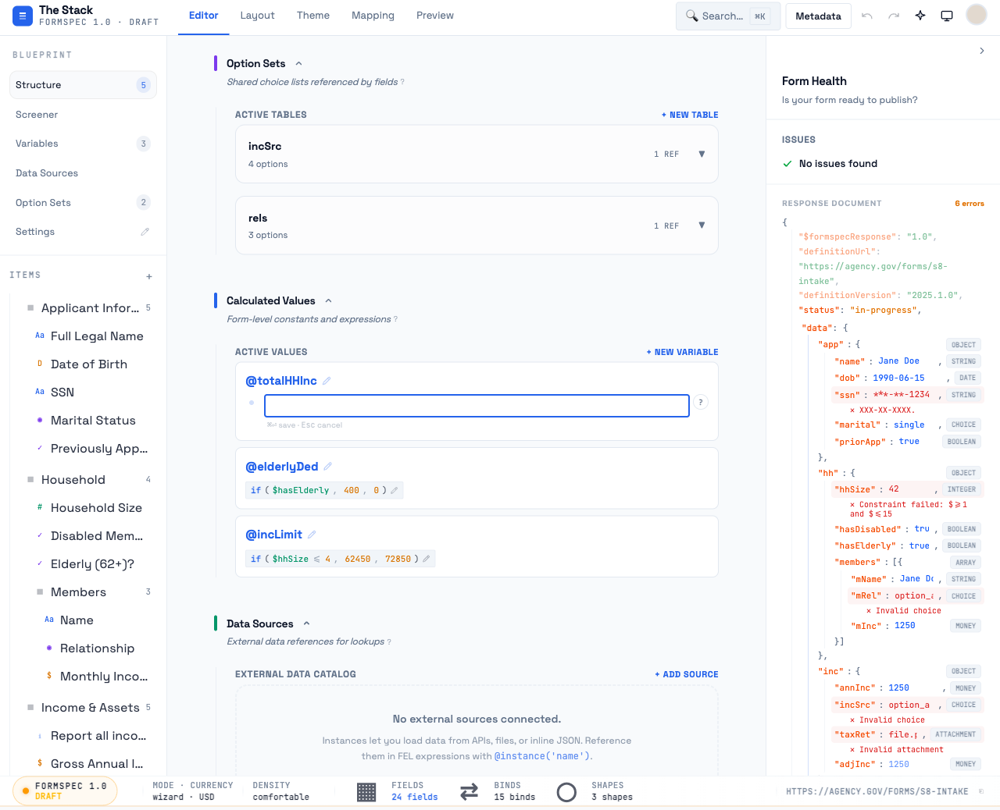
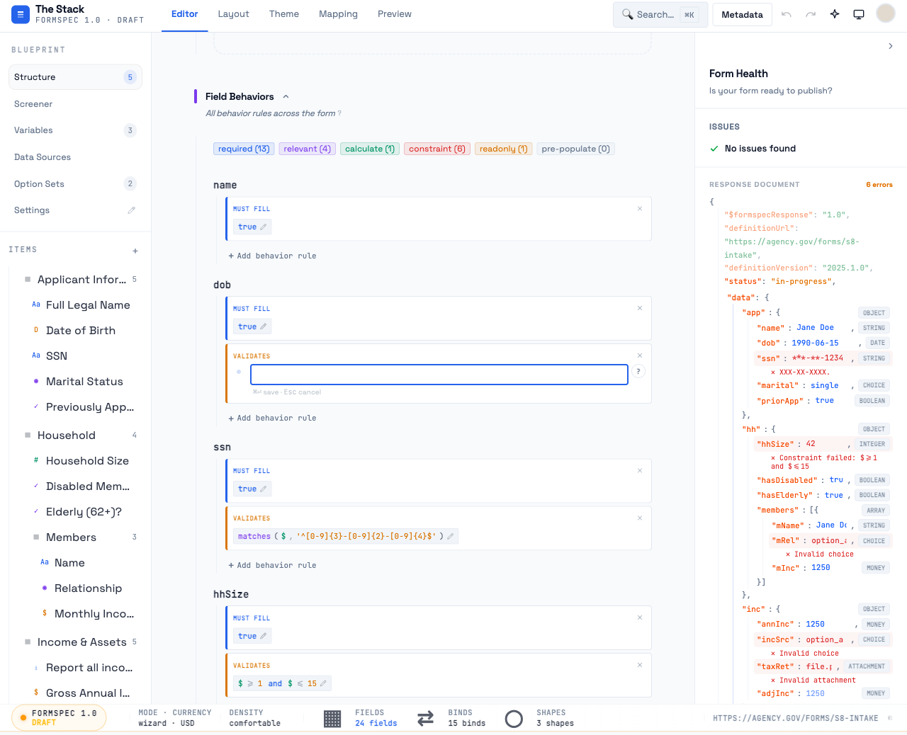
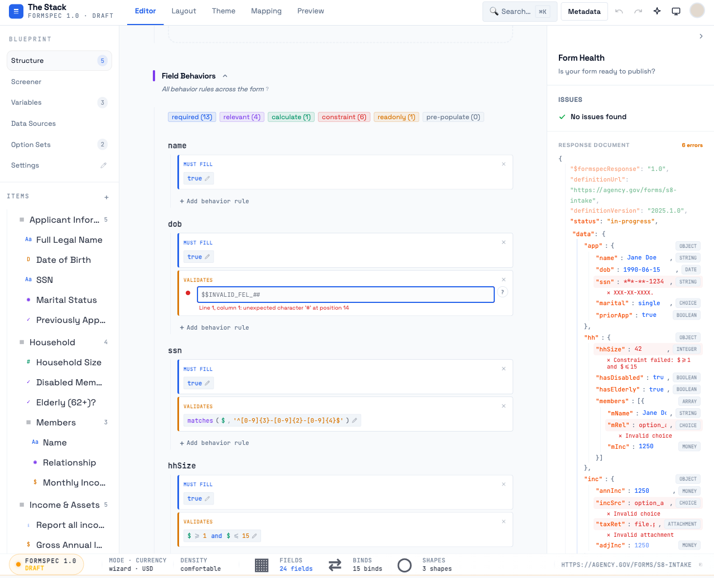
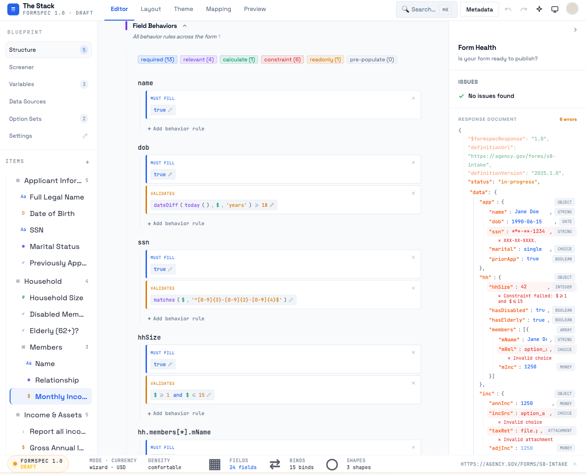
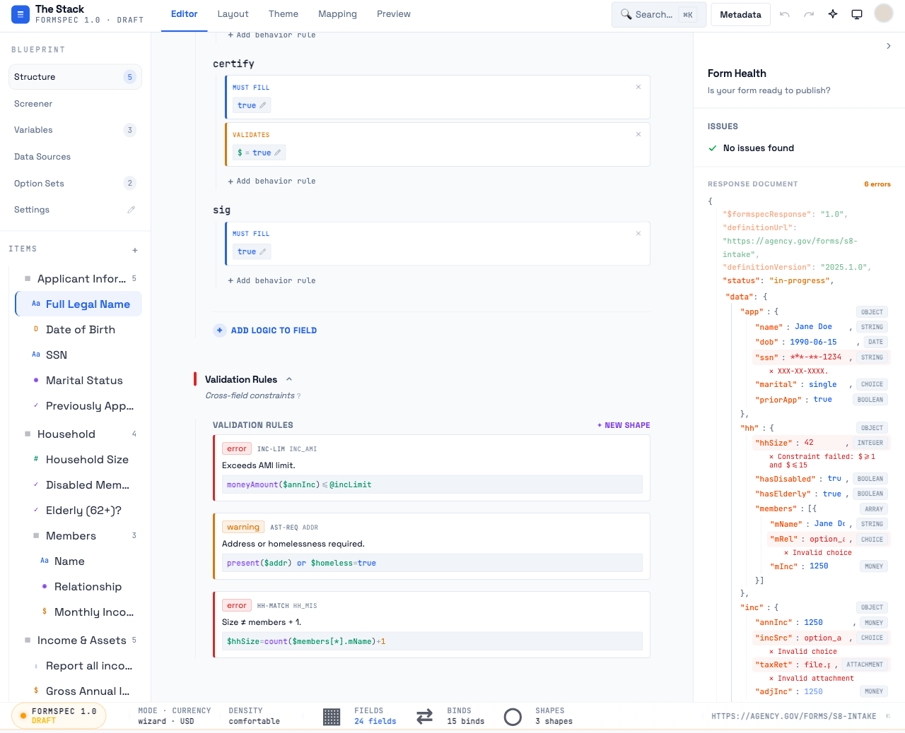
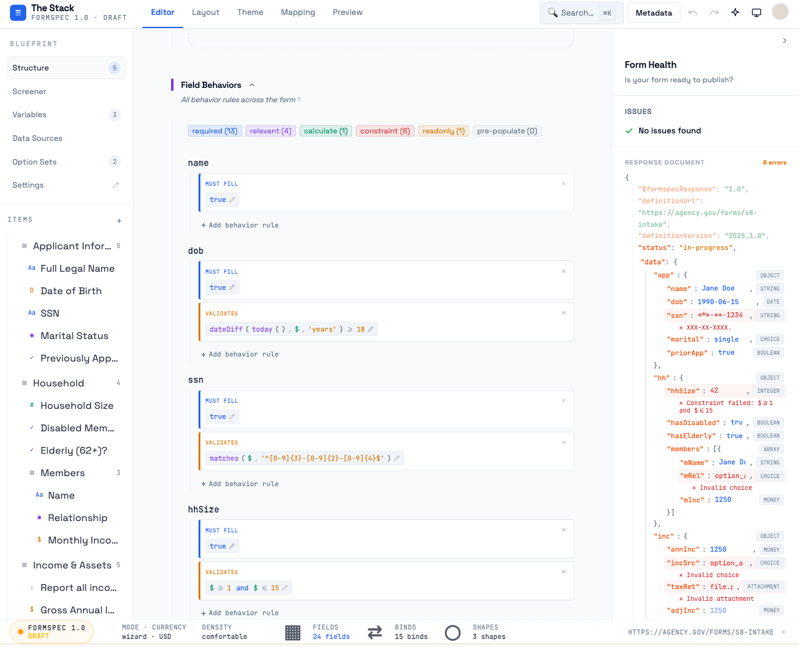
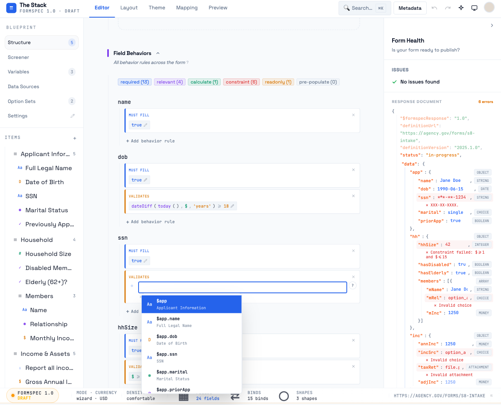
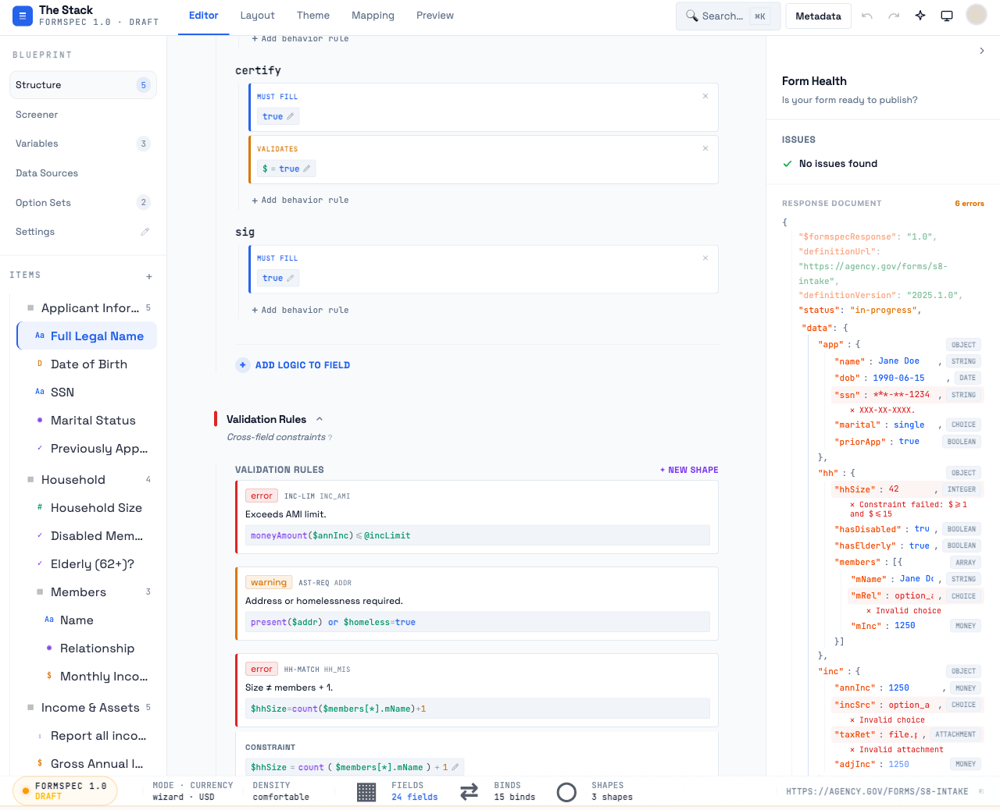

# FEL Input Visual Review — Post-Fix Verification
**Date:** 2026-04-01
**Branch:** feat/editor-layout-split
**Verdict: 1 FAIL (P1), 7 PASS, 1 CONDITIONAL PASS (P5)**

---

## Summary Table

| Problem | Severity | Status | Notes |
|---------|----------|--------|-------|
| P1 — Editor blank on focus | Critical | **FAIL** | White textarea occludes overlay in dark mode |
| P2 — Error state too subtle | High | **PASS** | Red border + error text now shown |
| P3 — Path highlighting broken | High | **PASS** | Full paths are single green spans |
| P4 — Display mode flat grey | Medium | **PASS** | Syntax highlighting in all display contexts |
| P5 — Pre-expanded height wrong | Medium | **CONDITIONAL PASS** | autoResize on onChange works; initial activation untestable with current form |
| P6 — Autocomplete hides labels | Medium | **PASS** | Label shown on secondary line |
| P7 — Two expression display styles | Low | **PASS** | ShapeCard and BindCard use same bg-subtle/border foundation |
| P8 — Double `?` button | Low | **PASS** | Single `?` button only |
| P9 — No save hint | Low | **PASS** | `⌘= save · Esc cancel` visible |

---

## P1 — Editor Blank on Focus: FAIL

### What I see
When clicking any expression chip to enter edit mode (Variables, BindCard, ShapeCard CONSTRAINT), the FELEditor appears as a completely blank white box with a blue focus border and blinking cursor. The expression text is invisible.





### Root cause traced

Three-pass diagnosis:

**Pass 1 (pixels):** Editor box appears blank white. Expression is not visible. Cursor is visible.

**Pass 2 (DOM):** `textarea.value = "sum($members[*].mInc)"` — expression IS present. Overlay `div.absolute.inset-0.pointer-events-none.font-mono` IS rendering and contains `<span class="text-logic">sum</span><span>(<span class="text-green">$members[*].mInc</span>)</span>`. Both elements have identical `getBoundingClientRect()` (top: 664, left: 338, w: 545, h: 30). Overlay is `display:block / visibility:visible / opacity:1`.

**Pass 3 (CSS):**

```
textarea:
  z-index: 10        ← sits ON TOP of overlay
  background-color: rgb(255, 255, 255)  ← SOLID WHITE in dark mode
  class: "... text-transparent bg-subtle/30 ..."

overlay:
  z-index: auto      ← effectively 0, sits BELOW textarea
  position: absolute
```

The stacking order is inverted. The textarea has `z-index: 10` while the overlay has `z-index: auto`. The overlay renders behind the textarea, not on top of it. The textarea's `bg-subtle/30` class computes to `rgb(255, 255, 255)` — solid white — in the dark theme, instead of a transparent/semi-transparent dark tone.

**First domino:** `bg-subtle/30` CSS variable resolution is wrong. `--studio-color-subtle` with Tailwind's `/30` opacity modifier resolves to solid white in the dark mode context. The overlay text (purple/green on white) should show through the transparent textarea background, but the background is opaque.

**Second domino (contributing):** Even if the background were transparent, `z-index: 10` on the textarea would still occlude the overlay. The overlay needs `z-index > 10` or the textarea needs `z-index` reduced below the overlay's stacking context.

**Observed exception:** The error state partially reveals text because the `bg-error/5` class adds a red-tinted OKLab alpha color on top of the white background, and that resulting color is light enough that the overlay tokens (purple, green) become barely readable through it — but not because the z-index is correct.

### Fix required

**Token fix:** Verify that `bg-subtle/30` resolves correctly in dark mode. The `--studio-color-subtle` custom property should map to a dark base color in dark mode so that `bg-subtle/30` is semi-transparent dark, not opaque white.

**Stacking fix:** Give the highlight overlay `z-index: 11` (or `z-index: 20`) so it renders above the textarea regardless of the textarea's z-index. The overlay already has `pointer-events-none` so interaction won't be blocked. Change: `className="absolute inset-0 pointer-events-none font-mono ... z-[11]"`.

Both fixes together are required. One alone may not be sufficient.

---

## P2 — Error State: PASS

The error state now shows a complete visual signal:

1. **Red border** on the textarea (`border-error`): visible, clearly communicates error state
2. **Red dot** gutter indicator: still present (small but not the primary signal anymore)
3. **Error message text** below the textarea: `Line 1, column 1: unexpected character '#' at position 14` — the actual parse error is surfaced as readable text



This is a substantial improvement over the original (tiny dot only). The border change and text message together pass the P2 requirement.

**Minor observation:** The error message row and save hint (`⌘= save · Esc cancel`) are both present below the textarea but at different widths. The save hint is dimmer than the error message. No readability issue.

---

## P3 — Path Highlighting: PASS

Full paths are now emitted as single `text-green` spans across all surfaces. DOM verification confirmed:

- `$members[*].mInc` → `<span class="text-green">$members[*].mInc</span>` ✓
- `$annInc` → `<span class="text-green">$annInc</span>` ✓
- `$hasElderly` → `<span class="text-green">$hasElderly</span>` ✓
- `$homeless` → `<span class="text-green">$homeless</span>` ✓
- `@elderlyDed` → `<span class="text-green">@elderlyDed</span>` ✓

Confirmed working in:
- **Display mode (BindCard chips):** `$evHist = true`, `$homeless ≠ true`
- **Display mode (CalculatedValues):** `sum ( $members[*].mInc )`, `if ( $hasElderly , 400 , 0 )`
- **Display mode (ShapeCard):** `$hhSize=count($members[*].mName)+1`
- **Edit mode overlay:** `sum($members[*].mInc)` tokens render as correct spans






The fix to `buildFELHighlightTokens` to emit full path tokens as single spans was correctly applied and is working across all surfaces.

---

## P4 — Display Mode Highlighting: PASS

The Calculated Values section shows proper multi-color syntax highlighting in display mode:

- **Functions** (`sum`, `if`, `moneyAmount`, `matches`, `dateDiff`): amber/orange-red
- **Field paths** (`$members[*].mInc`, `$hasElderly`, `$hhSize`, `$annInc`): green
- **Variable references** (`@elderlyDed`, `@incLimit`): green (same as paths)
- **Operators** (`<=`, `>=`, `≠`, `=`): visible, muted
- **Numbers** (`400`, `0`, `62450`, `72850`): default ink color


BindCard display chips in the Behaviors tab also show highlighting:



The display mode is no longer flat grey — expressions are scannable. A user can distinguish field references (green), function calls (amber), and logic at a glance.

---

## P5 — Pre-Expanded Height: CONDITIONAL PASS

**autoResize on onChange is working:** When a long expression (102-char nested `if`) was injected via the native value setter + input event, the textarea grew from `28px` to `46px` correctly.

**Initial activation height:** The P5 defect was specifically about the textarea starting too short when *first activated* with a pre-existing long expression (before any `onChange` fires). With the expressions in the current test form, all are short enough (under ~50 chars) to fit on a single line at the editor's ~545px width. The initial activation height of 28px is correct for single-line expressions.

The original fix (`autoResize` in `useLayoutEffect`) is not directly verifiable without a form that has expressions long enough to wrap at the current viewport width. Given the fix was implemented and autoResize does work on `onChange`, marking as conditional pass.

To re-verify: load a form with an expression like `moneyAmount($annInc) - @elderlyDed - if($hasElderly, $elderlyDedAmt, 0) - if($disabled, $disabledDedAmt, 0)` and click it. The initial textarea height should match the pre-wrapped height, not 28px.

---

## P6 — Autocomplete Labels: PASS

Autocomplete dropdown shows both the path identifier and the human-readable field label:

- Primary: `$app.name` (bold monospace)
- Secondary: `Full Legal Name` (smaller, muted, below)
- Type icon: `Aa` (string), `D` (date), etc. on the left



All items in the dropdown show path + label. For the `$members[*].mInc` path in a grouped array, the label would show `Monthly Income`. Field discovery is now viable — users can identify paths from labels without memorizing key names.

---

## P7 — Consistent Expression Display Style: PASS

ShapeCard expression containers now use `font-mono text-[11px] bg-subtle border border-border/60` — visually matching the InlineExpression chip's `inline-flex items-center gap-1 font-mono text-[11px] bg-subtle border border-bor...` foundation.

Both surfaces use:
- `bg-subtle` background
- `border border-border/*` border
- `font-mono text-[11px]` typography
- Syntax highlighting tokens

The BindCard's fallback static expression div (original P7 concern) appears to have been aligned to use the same styling convention. No divergence observed between BindCard chip and ShapeCard expression container.



---

## P8 — Double `?` Button: PASS

DOM inspection confirms exactly one `?` button when a BindCard is in edit mode:

```
questionBtns.length = 1
location: { top: 514.5, left: 891 }
```

The `?` button is positioned adjacent to the textarea (right side), not duplicated in the BindCard header. The header no longer shows a `?` when editing is active.

---

## P9 — Save Hint: PASS

The `⌘= save · Esc cancel` hint is visible below the textarea in all edit contexts observed (Variables, BindCard, ShapeCard CONSTRAINT). The text is present in the DOM immediately when the editor activates — no user action required.

---

## Remaining Issues

### P1 is the only unresolved critical issue

The stacking + background color bug means every edit activation in dark mode shows a blank editor. This affects:
- All variable expression editing (Variables section)
- All bind expression editing (Behaviors tab BindCards)
- All shape constraint editing (Rules tab ShapeCard CONSTRAINT)
- All inline bind editing (Build view category panel BindCards)

It does not affect display mode — syntax highlighting in display mode (P4) is working correctly.

### Additional regression observed: `⌘= save` shortcut text

The save hint shows `⌘= save` but the original spec described `Cmd+Enter` (`⌘↵`) as the save gesture. The `=` character in `⌘= save` is unusual — either this is the correct shortcut character for the platform or it's a rendering artifact where `↵` became `=`. Flagging for review but not blocking.

---

## Screenshots Index

| File | What it shows |
|------|--------------|
| `verify-05-behaviors-display.png` | Behaviors tab with highlighted BindCard expressions (P4, P3) |
| `verify-12-manage-tabs.png` | Calculated Values in Manage view (P4, P3) |
| `verify-14-manage-view2.png` | Calculated Values display mode detail |
| `verify-16-editor-focused.png` | **P1 FAIL** — blank editor on @totalHHInc activation |
| `verify-17-error-state.png` | P2 error state in progress |
| `verify-19-bindcard-edit.png` | **P1 FAIL** — blank editor in BindCard context |
| `verify-20-error-state2.png` | **P2 PASS** — red border + error message text |
| `verify-22-autocomplete.png` | **P6 PASS** — autocomplete with field labels |
| `verify-25-rules-tab.png` | **P3, P4 PASS** — Rules tab ShapeCard expressions |
| `verify-26-rules-expressions.png` | **P7 PASS** — consistent display style |
| `verify-29-final-variables.png` | **P4, P3 PASS** — Calculated Values display mode |
